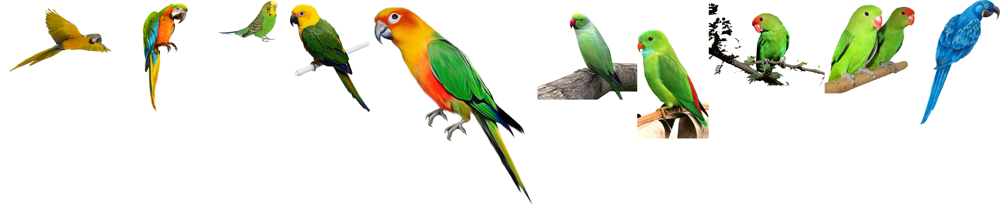
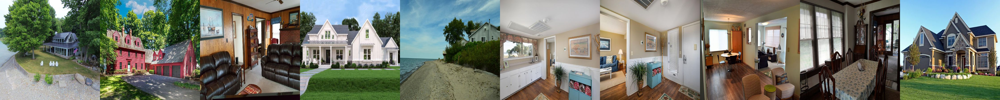
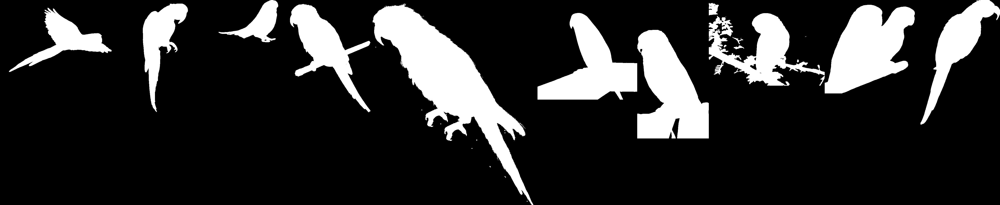
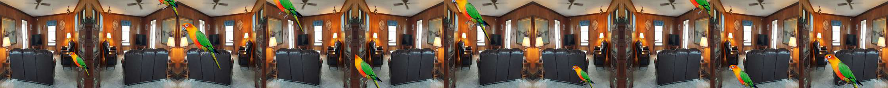
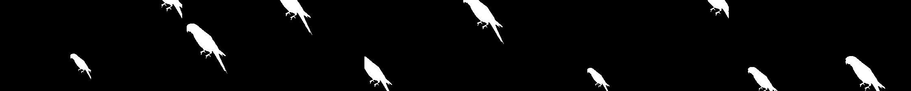
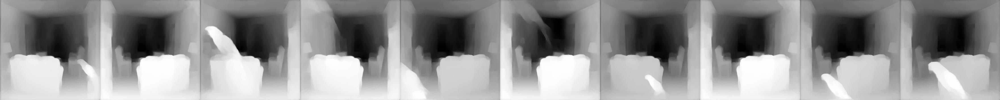

# S14/15A Data creation
There Six types of images are there in the dataset. They are
* Background 
* Foreground
* Foreground mask images
* FGBG
* FGBG masks
* Depth images

### Foreground images
* The Foreground images are downloaded from the internet. I downloaded 100 **parrot** images. 
* And another 100 images are created by flipping in GIMP.
* So there are 200  images are there now

### Background images
* There are 100 **house and shop** images are downloaded from internet.
* All the background images are square images of size 448x448x3.

### Foreground mask images
* I used the GIMP application to create the foreground mask images.
* First i deleted the background and filed with black color by using Selection tool.
* After that i filled with black color(CTRL + ,).
* And inverse seletion(CTRL I) of image will select the foreground and filled with white color(CTRL + .)
* The shortcuts are very useful in GIMP.

### FGBG and FGBG masks
* Now there are 100 bg images, 200 fg images and 200 masks are there.
* First all the 100 bg images are selected and 20 bg and images are selected at a time.
* Now one fg image is placed randomly on bg images by using random flipping
* At the same time mask are also created in the same way.

### Depth images
* Depth images are created by using [Depth Models](https://github.com/ialhashim/DenseDepth/blob/master/DenseDepth.ipynb)

